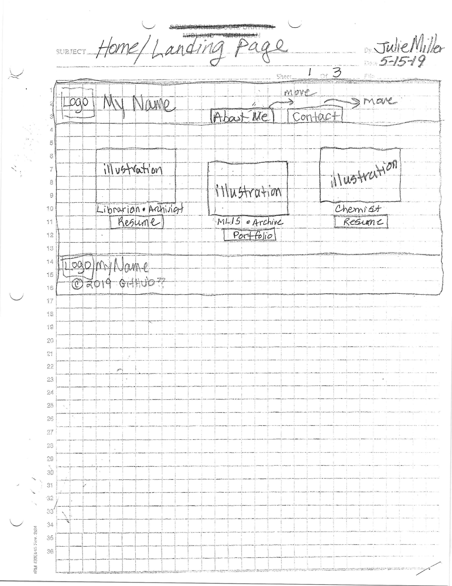
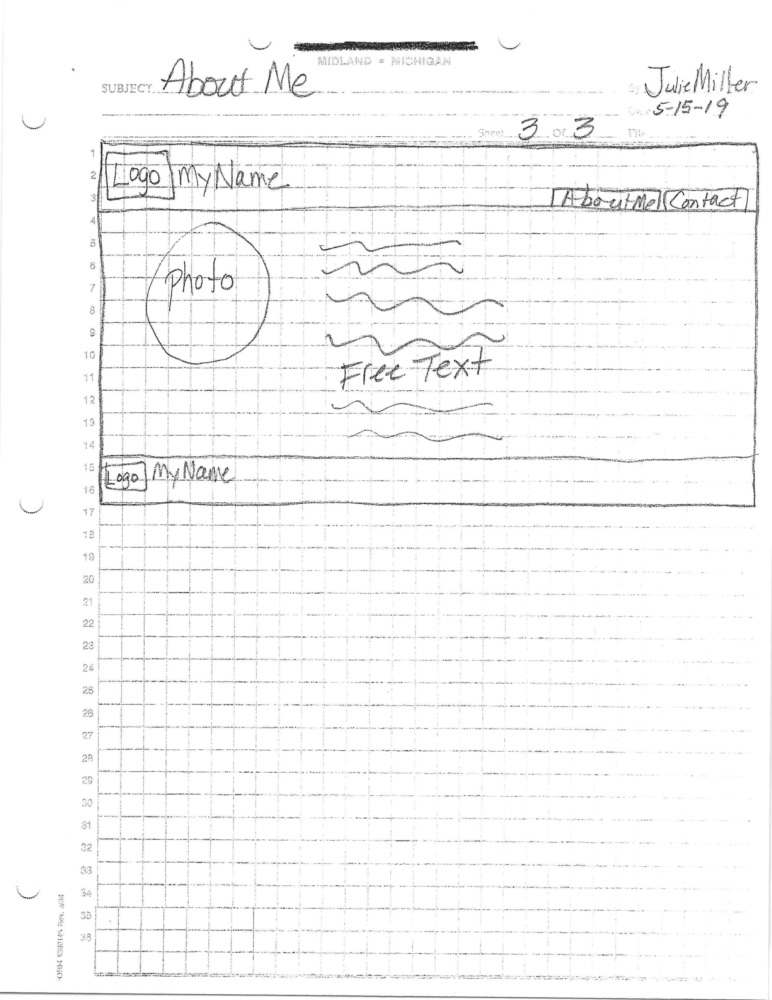
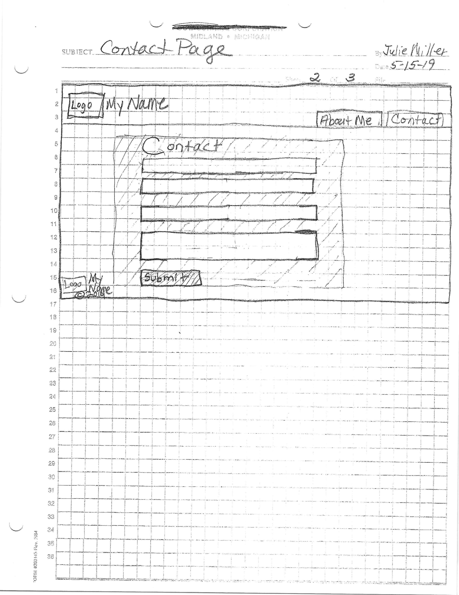

# My INF 7420 Website Design Project
I am going to build a portfolio site. The main purpose of this project will be to showcase my work and experience and help me find a job when I graduate.

## Wireframes
I value planning so here are some wireframes to show the site architecture and layout could possibly be.

Header - will include my navigation menu and my name. My name will be the link to get back to the home page.

Navigation menu - will include links to Contact page and About page.

Main content - will include 3 illustrations with 3 corresponding links below each illus. One illus. and link will be of librarian and archivist to resume. The 2nd illus. and link will be of MLIS and archive to portfolio. The 3rd illus. and link will be of chemist to resume. 

Footer - will include copyright information.

Header - will include my navigation menu and my name. My name will be the link to get back to the home page.

Navigation menu - will include links to Contact page and About page.

Main content - will include text and an image that is a headshot.

Footer - will include copyright information.

Header - will include my navigation menu and my name. My name will be the link to get back to the home page.

Navigation menu - will include links to Contact page and About page.

Main content - will include boxes to add name, email, and message.

Footer - will include copyright information.